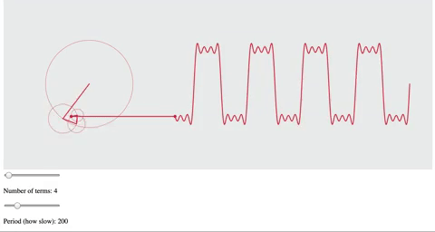
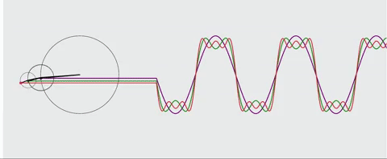
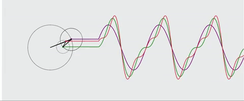

# Fourier Series Visualization

Visualizer for the Fourier Series of a square wave and sawtooth wave. Saw Coding Train's video on Youtube and decided to implement my own from scratch! So thanks to Coding Train for the cool idea. The visualizer was made using the p5.js library. The fourier.js file allows the user to play around with a square or sawtooth wave, while the multiplefourier.js file is meant to depict multiple Fourier series with different amount of terms.

### Visualization of Fourier Series with user controls for period of oscillation and number of terms

### Visualization of the first three terms of the Fourier Series for a square wave and sawtooth wave.

